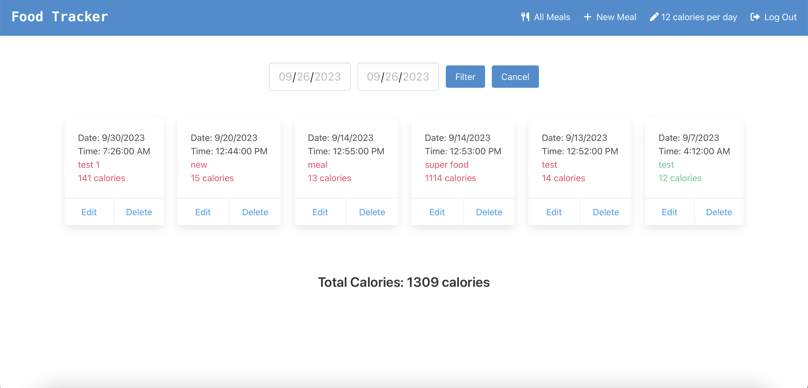

# Food Tracking App

Welcome to the Food Tracking App, a simple, single-page application designed to help users monitor and track their daily calorie intake. Store and manage your meals, set your daily calorie goals, and monitor your progress with intuitive visual cues.

## Features

- **User Authentication**: Create an account and log in to keep your data safe.
- **Meal Management**: Add, edit, or delete your meals, providing details such as date, time, description, and calories.
- **Visual Feedback**: Daily calorie consumption is color-coded to easily track if you're over or under your set goal.
- **Filtering Capabilities**: Filter your meals by date to quickly check your consumption for specific days.
- **User Settings**: Set your expected number of calories per day.
- **Client-Side Processing**: All actions, including data retrieval and updates, are done client-side using AJAX for a seamless user experience.